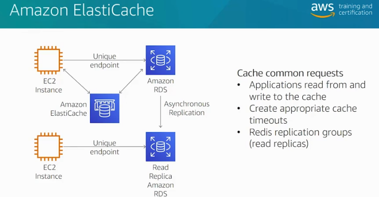
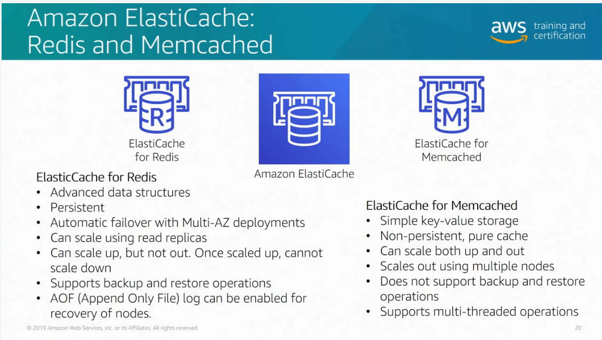

# Caching Strategies

- Lazy Loading – a caching strategy that loads data into the cache only when necessary.
  - Only requested data is cached.
  - Node failures are not fatal.
  - There is a cache miss penalty.
  - Stale data.
- Write Through – adds data or updates data in the cache whenever data is written to the database.
  - Data in the cache is never stale.
  - Write penalty vs. Read penalty. Every write involves two trips: A write to the cache and a write to the database
  - Missing data.
  - Cache churn.
- By adding a time to live (TTL) value to each write, we are able to enjoy the advantages of each strategy and largely avoid cluttering up the cache with superfluous data.

  
   
    <em>Amazon Elastic Cache Index. Source: AWS Official Training</em>

</n>
</n>
</n>
</n>

  
   
    <em>Redis vs Memcached. Source: AWS Official Training</em>

