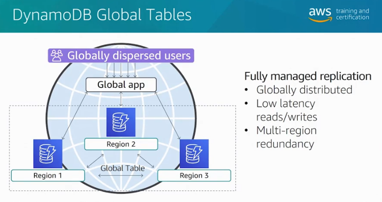
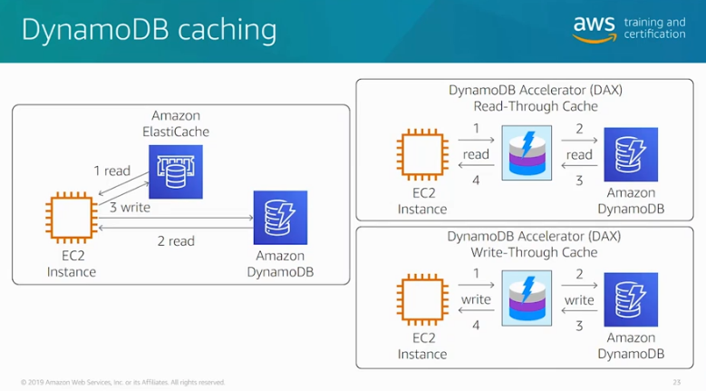

# AWS DynamoDB

- Fully-managed NoSQL database service that makes it simple and cost effective to store and retrieve any amount of data
DynamoDB helps offload the administrative burden of operating and scaling a highly-available distributed database cluster.
- This storage alternative meets the latency and throughput requirements of highly demanding applications by providing single-digit millisecond latency.
- DynamoDB stores structured data in tables, indexed by primary key, and allows low-latency read and write access to items ranging from 1 byte up to 400 KB.

  
   
    <em>Dynamo Global Secondary Index vs Local Secondary Index. Source: AWS Official Training</em>

## DynamoDB Accelerator

- DynamoDB Accelerator is used for caching requests if you need response times in microseconds. This is very expensive.
  

## Global Tables:

  - Provide you with a fully managed, multi-region, and multi-master database that provides fast, local, read and write performance for massively scaled, global applications.
  - Replicates your Amazon DynamoDB tables automatically across your choice of AWS regions.
  - Searching for archives in Glacier takes a long time, then it is advisable to store the search criteria and archive ID to a database for faster search.
  - You can purchase reserved capacity in advance to lower the costs of running your DynamoDB instance.
  - With reserved capacity, you pay a one-time upfront fee and commit to a minimum usage level over a period of time significant cost savings compared to on-demand provisioned throughput settings.
- You can only set the auto scaling target utilization values between 20 and 90 percent for your read and write capacity, not 100%.

  
   
    <em>Dynamo DB Global Tables. Source: AWS Official Training</em>

## DynamoDB conditional writes

- According to the log, the problem is that a second read gets the value from the table before a first read updates it. You can use conditional writes to prevent this issue.

  
   
    <em>Dynamo DB Caching. Source: AWS Official Training</em>

