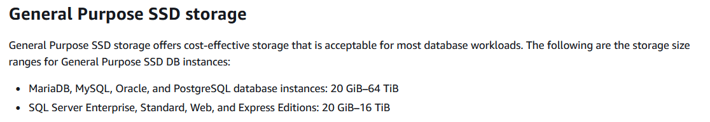
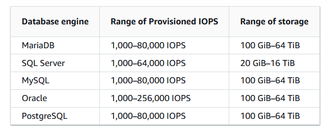
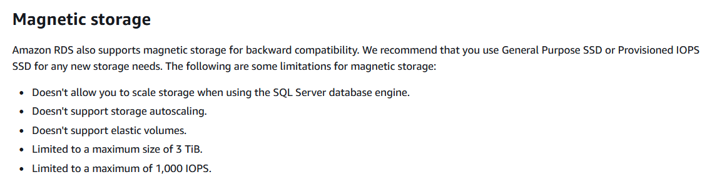

# Amazon RDS

- Oracle RAC is not supported by RDS. **important**
- DB2 is supported by RDS (All IBM Websphere products are supported by AWS) 
- An Oracle Real Application Clusters (RAC) One Node option provides virtualized servers on a single machine. 
- There is no automatic way to promote the read replica on the backup region as the master database, and when you do,  when you do, the RDS instance will reboot. 
- You can promote the read replica directly to a standalone DB instance. It is not necessary to make a snapshot and recreate the cluster
- MySQL does not support auto scaling for read replicas.

## Amazon RDS storage types

- General Purpose SSD (also known as gp2), Provisioned IOPS SSD (also known as io1), and magnetic (also known as standard)

- You can create MySQL, MariaDB, Oracle, and PostgreSQL RDS DB instances with up to 64 tebibytes (TiB) of storage. You can create SQL Server RDS DB instances with up to 16 TiB of storage. For this amount of storage, use the Provisioned IOPS SSD and General Purpose SSD storage types.

  - General Purpose SSD – General Purpose SSD volumes offer cost-effective storage that is ideal for a broad range of workloads. These volumes deliver single-digit millisecond latencies and the ability to burst to 3,000 IOPS for extended periods of time. Baseline performance for these volumes is determined by the volume's size.

  - Provisioned IOPS – Provisioned IOPS storage is designed to meet the needs of I/O-intensive workloads, particularly database workloads, that require low I/O latency and consistent I/O throughput.

  - Magnetic – Amazon RDS also supports magnetic storage for backward compatibility. We recommend that you use General Purpose SSD or Provisioned IOPS for any new storage needs. 

  
   
    <em>General Purpose SSD Storage. Source: https://digitalcloud.training/</em>

</n>
</n>

  
   
    <em>Provisioned IOPS SSD Storage. Source: https://digitalcloud.training/</em>

</n>
</n>

  
   
    <em>Magnetic Storage. Source: https://digitalcloud.training/</em>

</n>
</n>

## Troubleshooting Scenario

**Scenario**: Amazon CloudWatch DiskQueueDepth metric for the DB instance increases suddenly during peak usage periods.
**Solution**: Double the amount of I/O that DB instance can handle