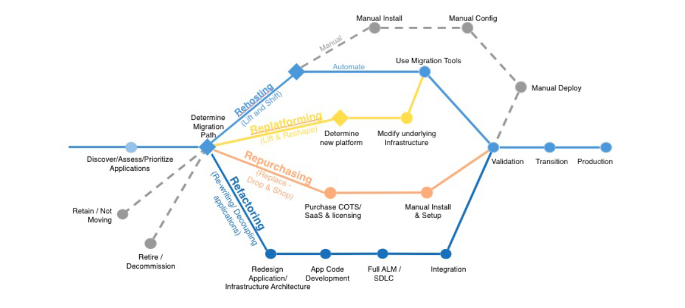
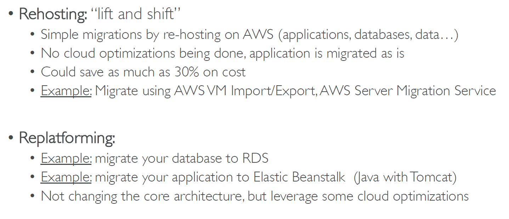
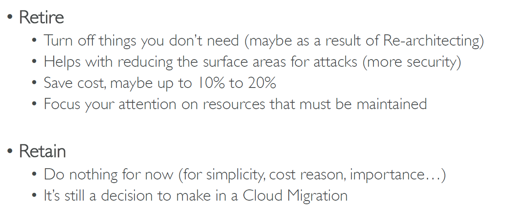
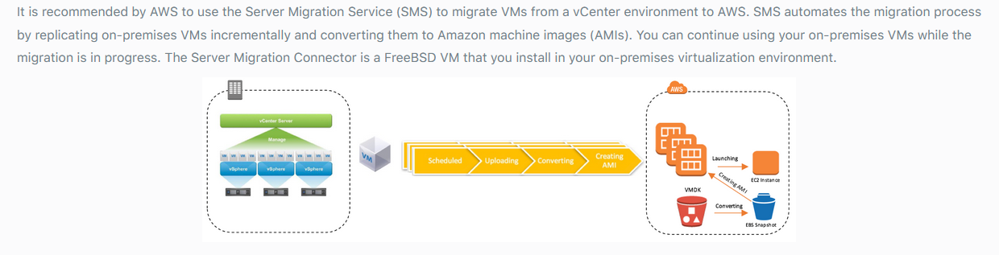

# AWS DMS migration task & General Concepts on Migration:

- Create a source endpoint, a target endpoint, and a replication instance before you create a migration task. 
- Choose a migration method:
  - Migrating data to the target database–creates files or tables in the target database and automatically defines the metadata that is required at the target
  - Capturing changes during migration–This process captures changes to the source database that occur while the data is being migrated from the source to the target. 
  - Replicating only data changes on the source database.
- reads the recovery log file of the source database management system (DBMS) and groups together the entries for each transaction

## General Information

  
   
    <em>Migration Paths. Source: https://courses.datacumulus.com//</em>

</n>
</n>

  
   
    <em>Rehosting and Replataforming Paths. Source: https://courses.datacumulus.com/</em>

</n>
</n>

  
   
    <em>Repurchase and Refactoring Paths. Source: https://courses.datacumulus.com/</em>

</n>
</n>

  
   
    <em>Retire and Retain Paths. Source: https://courses.datacumulus.com/</em>

</n>
</n>

  
   
    <em>RTO & RPO Table. Source: https://courses.datacumulus.com/</em>

</n>
</n>

  
   
    <em>AWS SMS. Source: https://courses.datacumulus.com/</em>

</n>
</n>