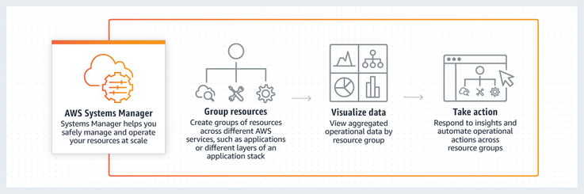
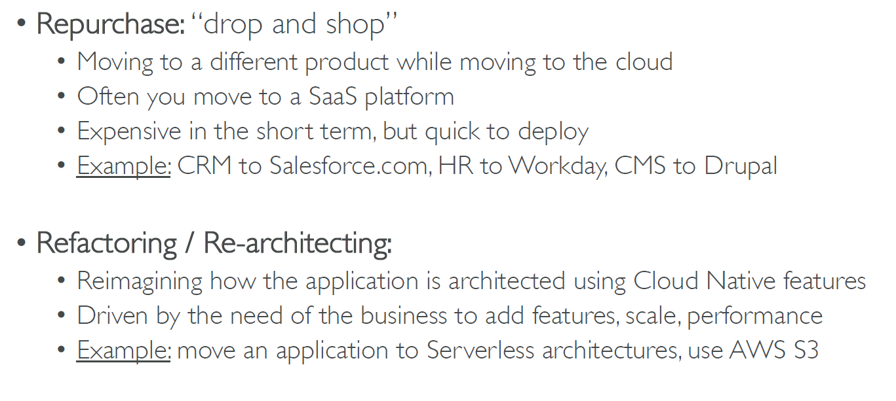
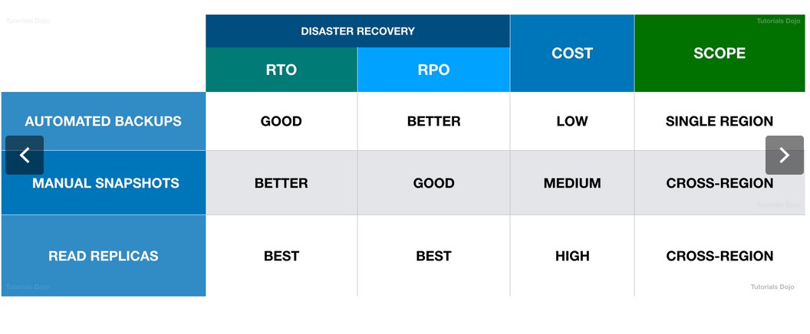
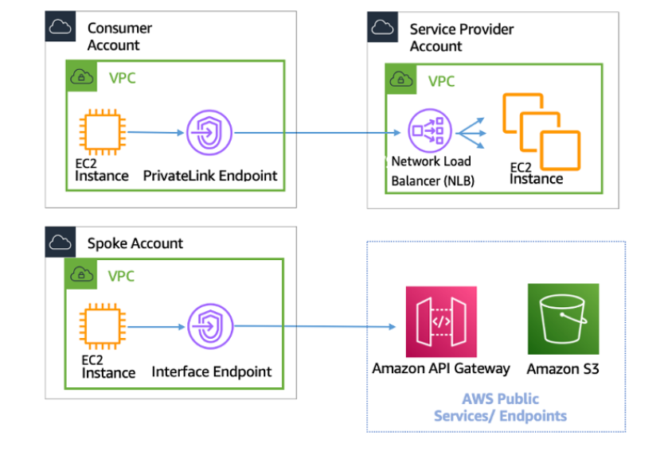

# AWS SAP Preparation

Repository for AWS Solutions Architect Professional (SAP-C02) exam preparation, including theory and practice (hands-on labs).

**Last Updated: January 2025** - Includes latest 2025 AWS service updates and exam changes.

Chapters have been categorized based on the latest [AWS Certified Solutions Architect - Professional (SAP-C02) Exam Guide](https://d1.awsstatic.com/training-and-certification/docs-sa-pro/AWS-Certified-Solutions-Architect-Professional_Exam-Guide.pdf).

## Exam Overview (SAP-C02)

The AWS Certified Solutions Architect - Professional validates advanced technical skills and experience in designing optimized AWS solutions based on the AWS Well-Architected Framework.

### Exam Details

- **Exam Code**: SAP-C02 (replaced SAP-C01 in November 2022)
- **Format**: 75 questions (65 scored + 10 unscored)
- **Duration**: 180 minutes (3 hours)
- **Passing Score**: 750 out of 1000
- **Cost**: $300 USD
- **Validity**: 3 years

### Exam Domains and Weightings

| Domain | Weight |
|--------|--------|
| Domain 1: Design Solutions for Organizational Complexity | 26% |
| Domain 2: Design for New Solutions | 29% |
| Domain 3: Continuous Improvement for Existing Solutions | 25% |
| Domain 4: Accelerate Workload Migration and Modernization | 20% |

### Key Changes from SAP-C01 to SAP-C02

- **Organizational Complexity** increased from 12.5% to 26% (largest change).
- Strong focus on **multi-account architecture** using AWS Organizations.
- **Cost Optimization** removed as standalone domain - integrated across all domains.
- Alignment with AWS Well-Architected Framework pillars.
- Emphasis on modern architectures: serverless, containers, generative AI.

## Reference Materials

Please find below the list of Referenced materials for this Guide. I have included both free and paid resources used to create this material

1. Udemy - https://www.udemy.com/course/aws-solutions-architect-professional/
2. Tutorials Dojo - https://portal.tutorialsdojo.com/
3. AWS SA Professional Training - https://cloudacademy.com/
4. AWS Certified SAP Hands on - https://digitalcloud.training/
5. AWS Exam Readiness SAP - https://aws.amazon.com/certification/certified-solutions-architect-professional/
6. AWS WhitePapers - https://aws.amazon.com/whitepapers/
7. AWS Free practice questions - https://explore.skillbuilder.aws/

## What's New in 2025

### New Services and Major Updates

- **AWS Lambda Durable Functions** - Run workflows up to 366 days with automatic checkpointing
- **Amazon Bedrock** - Fully managed foundation models including Amazon Nova
- **Amazon Nova** - AWS's new generation of foundation models (Micro, Lite, Pro, Premier, Canvas, Reel, Act)
- **Amazon Q Developer** - AI-powered coding assistant with agentic capabilities
- **Amazon S3 Vectors** - Native vector storage supporting 2 billion vectors per index
- **S3 Express One Zone** - 10x faster performance, 80% lower request costs
- **AWS Graviton5** - 25% better performance, 192 cores, 5x larger L3 cache
- **Amazon EKS Auto Mode** - Fully automated infrastructure management
- **Amazon EKS Hybrid Nodes** - On-premises and edge nodes in EKS clusters
- **Aurora Blue/Green Deployments** - Safe updates for Global Databases
- **RDS Storage Expansion** - SQL Server and Oracle now support up to 256 TiB (4x increase)

### Deprecated Services

- **AWS OpsWorks** - End of life May 2024 (migrate to Systems Manager, CloudFormation, or ECS/EKS)
- **Amazon Lex V1** - No new resources after March 2025, all requests fail September 2025
- **AWS CodeCommit** - Discontinued for new accounts June 2024
- **AWS Cloud9** - Closed to new customers July 2024
- **Amazon QLDB** - Deprecated July 2025

## Table of Contents

### Application Integration
- [AWS OpsWorks](Application%20_Integration/OpsWorks.md) - **DEPRECATED 2024**
- [Amazon SQS](Application%20_Integration/SQS.md)

### Billing and Cost Management
- [AWS Cost & Usage Report](Billing_Cost_Mgmt/Cost_Usage_Report.md)

### Compute
- [Amazon ECS](Compute/ECS.md) - Elastic Container Service
- [Amazon EKS](Compute/EKS.md) - Elastic Kubernetes Service **NEW 2025**
  - EKS Auto Mode
  - EKS Hybrid Nodes
- [AWS Lambda](Compute/Lambda.md) - **UPDATED 2025** with Durable Functions
- [Elastic Load Balancing](Compute/ELB.md) - ALB, NLB, CLB
- [AWS Graviton Processors](Compute/Graviton.md) - **NEW 2025** Graviton4 & Graviton5
- [EC2 Placement Groups](Compute/Placementgroup.md)

### Databases
- [Amazon Neptune](Databases/AmazonNeptune.md) - Graph database
- [Amazon Aurora](Databases/Aurora.md) - **UPDATED 2025** with Blue/Green Deployments
- [Amazon RDS](Databases/RDS.md) - **UPDATED 2025** with 256 TiB storage
- [Caching Strategies](Databases/Cache.md) - ElastiCache patterns
- [Amazon DynamoDB](Databases/DynamoDB.md)
- [Amazon Redshift](Databases/RedShift.md)

### Developer Tools
- [AWS CodeDeploy](Developer_tools/CodeDeploy.md)
- [Amazon Q Developer](Developer_tools/Q_Developer.md) - **NEW 2025** AI coding assistant

### End User Computing
- [Amazon AppStream 2.0](End_user_Computing/AppStream.md)
- [Amazon WorkSpaces](End_user_Computing/WorkSpaces.md)

### Generative AI and Machine Learning
- [Amazon Bedrock](Machine_Learning/Bedrock.md) - **NEW 2025** Foundation models & Amazon Nova
- [Amazon SageMaker AI](Machine_Learning/SageMaker.md) - **NEW 2025** with serverless customization
- [Amazon Lex](Machine_Learning/aws_Lex.md) - **UPDATED 2025** V1 deprecation notice
- [Amazon Comprehend](Machine_Learning/Comprehend.md)
- [Amazon Polly](Machine_Learning/Polly.md)
- [Amazon Transcribe](Machine_Learning/Transcribe.md)
    - [Management_Goverment](#management_goverment)
      - [The AWS Service Catalog](#the-aws-service-catalog)
      - [AWS CloudFormation:](#aws-cloudformation)
      - [AWS CloudFront](#aws-cloudfront)
        - [Sample Question:](#sample-question)
      - [AWS CloudTrail](#aws-cloudtrail)
        - [Organization trail](#organization-trail)
      - [IAM](#iam)
        - [General_Details](#general_details)
        - [IAM Policies](#iam-policies)
        - [Take-away information](#take-away-information)
        - [IAM AWS Managed Policies](#iam-aws-managed-policies)
        - [IAM Policies Conditions](#iam-policies-conditions)
        - [IAM Policies Variables and Tags](#iam-policies-variables-and-tags)
        - [IAM Roles vs Resource Based Policies](#iam-roles-vs-resource-based-policies)
        - [Other details](#other-details)
      - [AWS Compute Optimizer](#aws-compute-optimizer)
      - [AWS RAM](#aws-ram)
      - [Amazon SCP:](#amazon-scp)
      - [Systems Manager Automation](#systems-manager-automation)
      - [AWS Systems Manager Parameter Store](#aws-systems-manager-parameter-store)
        - [Key Question](#key-question)
    - [Migration_and_Transfer](#migration_and_transfer)
      - [AWS Application Discovery Service](#aws-application-discovery-service)
      - [CloudEndure Migration](#cloudendure-migration)
      - [AWS DMS migration task & General Concepts on Migration:](#aws-dms-migration-task--general-concepts-on-migration)
        - [General Information](#general-information)
      - [AWS Migration Hub](#aws-migration-hub)
        - [AWS Snowball Edge](#aws-snowball-edge)
      - [AWS Transfer Family](#aws-transfer-family)
    - [Networking](#networking)
      - [AWS Global Accelerator](#aws-global-accelerator)
      - [AWS Direct Connect](#aws-direct-connect)
        - [AWS Direct Connect gateway:](#aws-direct-connect-gateway)
      - [Lambda@Edge](#lambdaedge)
      - [Private Link](#private-link)
      - [AWS Route53](#aws-route53)
      - [VPC](#vpc)
        - [Lambda on VPC](#lambda-on-vpc)
        - [General Concepts](#general-concepts)
    - [Security](#security)
      - [AWS CloudHSM](#aws-cloudhsm)
      - [AWS Security Hub](#aws-security-hub)
      - [Amazon Inspector](#amazon-inspector)
      - [Amazon Macie](#amazon-macie)
      - [AWS Shield](#aws-shield)
    - [Storage](#storage)
      - [Amazon_FSx_for_Windows_FS](#amazon_fsx_for_windows_fs)
      - [Amazon Glacier](#amazon-glacier)
        - [retrieval options:](#retrieval-options)
          - [Expedited](#expedited)
          - [Standard](#standard)
          - [Bulk](#bulk)
          - [Pricing:](#pricing)
      - [Simple_Service_Storage_S3](#simple_service_storage_s3)
        - [storage classes](#storage-classes)
        - [Security](#security-1)
        - [Data Management](#data-management)
        - [Use cases](#use-cases)
        - [S3 Cross-Region Replication](#s3-cross-region-replication)
        - [Amazon S3 Transfer Acceleration](#amazon-s3-transfer-acceleration)

### Application Integration

#### AWSOpworks

- Let you use Chef and Puppet to automate how servers are configured, deployed, and managed across
your Amazon EC2 instances or on-premises compute environments. 
- It can’t deploy AWS Lambda applications.
- AWS OpsWorks Stacks automatically installs the latest updates during setup, after an instance finishes booting. 
- AWS OpsWorks Stacks does not automatically install updates after an instance is online, to avoid interruptions such as restarting application servers. Instead, you manage updates to your online instances yourself, so you can minimize any disruptions.
- On Linux-based instances in Chef 11.10 or older stacks, run the Update Dependencies stack command, which installs the current set of security patches and other updates on the specified instances.

#### SQS

- Fully managed message queuing service that makes it easy to decouple and scale microservices, distributed systems, and serverless applications.
- To have compatibility with JMS or other protocols like MQTT AMQP, we use Amazon MQ
- You can use SQS to buffer and scale the backend service to accommodate the large incoming traffic. 
- You can save the submitted answers on the SQS Queue and then quickly return the user to a new page stating that the answers are successfully submitted. 
- This is a simple cost-effective design that improves user experience without increasing the capacity of your systems.
- SQS makes it simple and cost-effective to decouple and coordinate the components of a cloud application
you can send, store, and receive messages between software components at any volume, without losing messages or requiring other services to be available all the time
- An SQS queue cannot be used as a direct input for an AWS Step Function workflow.

### Billing_Cost_Mgmt

#### AWS_Cost_Usage_Report

- The most comprehensive set of AWS cost and usage data available, including additional metadata about: 
  - AWS services, pricing, credit, fees, taxes, discounts, cost categories, Reserved Instances, and Savings Plans.
- AWS delivers the AWS Cost & Usage Report to whichever Amazon Simple Storage Service (S3) bucket you specify during setup
- You can configure your Cost & Usage Reports to integrate with Amazon Athena.

### Compute

#### AWS_ECS

- You can register Spot Instances to your Amazon ECS clusters.
- Amazon EC2 terminates, stops, or hibernates your Spot Instance when the Spot price exceeds the maximum price for your request or capacity is no longer available
- Amazon EC2 provides a Spot Instance interruption notice, which gives the instance a two-minute warning before it is interrupted.
- ECS Spot Instance draining is enabled on the instance, ECS receives the Spot Instance interruption notice and places the instance in DRAINING status.
- Container instance is set to DRAINING -> Amazon ECS prevents new tasks from being scheduled for placement on the container instance
- Spot Instance draining is disabled by default and must be manually enabled by adding the line:
    ECS_ENABLE_SPOT_INSTANCE_DRAINING=true on your /etc/ecs/ecs.config file.
- The recommended best practice is to select the “Diversified” strategy, to maximize provisioning choices, while reducing the costs. 

##### Task_definitions

- Split into separate parts: the task family, the IAM task role, the network mode, container definitions, volumes, 
  task placement constraints, and launch types.
- The networking behavior of Amazon ECS tasks hosted on Amazon EC2 instances is dependent on the network mode defined in the task definition. The following are the available network modes. Amazon ECS recommends using the awsvpc network mode unless you have a specific need to use a different network mode.
  - **awsvpc**: The task is allocated its own elastic network interface (ENI) and a primary private IPv4 address. This gives the task the same networking properties as Amazon EC2 instances.
  - **bridge**: The task utilizes Docker's built-in virtual network which runs inside each Amazon EC2 instance hosting the task.
  - **host**: The task bypasses Docker's built-in virtual network and maps container ports directly to the ENI of the Amazon EC2 instance hosting the task. As a result, you can't run multiple instantiations of the same task on a single Amazon EC2 instance when port mappings are used.
  - **none**: The task has no external network connectivity.

#### ELB

##### Application Load Balancer:

- You can host multiple TLS secured applications, each with its own TLS certificate.
- In order to use SNI, all you need to do is bind multiple certificates to the same secure listener on your load balancer.
- ALB will automatically choose the optimal TLS certificate for each client. These features are provided at no additional charge.
- A wildcard certificate can only handle multiple sub-domains but not different domain names.
- SNI Custom SSL
  - Provides an efficient way to deliver content over HTTPS using your own domain and SSL certificate
  - Relies on the SNI extension of the Transport Layer Security protocol
  - Allows multiple domains to serve SSL traffic over the same IP address by including the hostname which the viewers are trying to connect to.
- ELB access logs will be delayed by at least 5 minutes before they arrive in Amazon S3

- In the ALB, you can create a listener that uses encrypted connections (also known as SSL offload). This feature enables traffic encryption between your load balancer and the clients that initiate SSL or TLS sessions.
- To use an HTTPS listener, you must deploy an SSL/TLS server certificate on your load balancer. The load balancer uses this certificate to terminate the connection and then decrypt requests from clients before sending them to the targets.
- Although you can terminate the SSL in the EC2 instance, this setup is not recommended in this scenario. It is best to store the SSL certificate in IAM or in AWS Certificate Manager (ACM) where you can control which teams, either the Security or the Development team, can have access.
- The clients access the website through the Load Balancer and not the EC2 instances directly. Using CloudHSM to store your SSL certificate will just increase your costs without satisfying the requirement.

#### Placement Group

- When you launch a new EC2 instance, the EC2 service attempts to place the instance in such a way that all of your 
- Instances are spread out across underlying hardware to minimize correlated failures. You can use placement groups to influence the placement of a group of interdependent instances to meet the needs of your workload. 
- Depending on the type of workload, you can create a placement group using one of the following placement strategies:
  • **Cluster** – packs instances close together inside an Availability Zone. This strategy enables workloads to achieve the low-latency network performance necessary for tightly-coupled node-to-node communication that is typical of HPC applications.
  • **Partition** – spreads your instances across logical partitions such that groups of instances in one partition do not share the underlying hardware with groups of instances in different partitions. This strategy is typically used by large distributed and replicated workloads, such as Hadoop, Cassandra, and Kafka.
  • **Spread** – strictly places a small group of instances across distinct underlying hardware to reduce correlated failures.
- There is no charge for creating a placement group. Charges are applied once EC2 instances are deployed.

### Databases

#### Amazon_Neptune

- Fast, reliable, fully-managed graph database service that makes it easy to build and run applications that work with highly connected datasets.
- The core of Neptune is a purpose-built, high-performance graph database engine.
- This engine is optimized for storing billions of relationships and querying the graph with milliseconds latency.

#### Amazon_Aurora

- It is recommended to use Aurora Serverless for lightly-used applications, with peaks of 30 minutes to several hours 
a few times each day or several times per year, such as human resources, budgeting, or operational reporting application.
- Aurora can store up to 128 TB of data. Unless the database engine version is different, schema conversion is not required.
- Aurora  can scale the replicas as needed.

##### Amazon_Aurora_Global_Database

- Designed for globally distributed applications, allowing a single Amazon Aurora database to span multiple AWS regions
Replicates your data with no impact on database performance, enables fast local reads with low latency in each region
- Provides disaster recovery from region-wide outages.
- Uses storage-based replication with typical latency of less than 1 second
- Unlikely event of a regional degradation or outage, one of the secondary regions can be promoted to read and write capabilities in less than 1 minute.
- Typical cross-region replication latencies below 1 second
- If your primary region suffers a performance degradation or outage, you can promote one of the secondary regions to take read/write responsibilities.
- Effective Recovery Point Objective (RPO) of 1 second and a Recovery Time Objective (RTO) of less than 1 minute,

#### Caching Strategies

- Lazy Loading – a caching strategy that loads data into the cache only when necessary.
  - Only requested data is cached.
  - Node failures are not fatal.
  - There is a cache miss penalty.
  - Stale data.
- Write Through – adds data or updates data in the cache whenever data is written to the database.
  - Data in the cache is never stale.
  - Write penalty vs. Read penalty. Every write involves two trips: A write to the cache and a write to the database
  - Missing data.
  - Cache churn.
- By adding a time to live (TTL) value to each write, we are able to enjoy the advantages of each strategy and largely avoid cluttering up the cache with superfluous data.

  
   
    <em>Amazon Elastic Cache Index. Source: AWS Official Training</em>

</n>
</n>
</n>
</n>

  
   
    <em>Redis vs Memcached. Source: AWS Official Training</em>

#### Amazon RDS

- Oracle RAC is not supported by RDS. **important**
- DB2 is supported by RDS (All IBM Websphere products are supported by AWS) 
- An Oracle Real Application Clusters (RAC) One Node option provides virtualized servers on a single machine. 
- There is no automatic way to promote the read replica on the backup region as the master database, and when you do,  when you do, the RDS instance will reboot. 
- You can promote the read replica directly to a standalone DB instance. It is not necessary to make a snapshot and recreate the cluster
- MySQL does not support auto scaling for read replicas.

##### Amazon RDS storage types

- General Purpose SSD (also known as gp2), Provisioned IOPS SSD (also known as io1), and magnetic (also known as standard)

- You can create MySQL, MariaDB, Oracle, and PostgreSQL RDS DB instances with up to 64 tebibytes (TiB) of storage. You can create SQL Server RDS DB instances with up to 16 TiB of storage. For this amount of storage, use the Provisioned IOPS SSD and General Purpose SSD storage types.

  - General Purpose SSD – General Purpose SSD volumes offer cost-effective storage that is ideal for a broad range of workloads. These volumes deliver single-digit millisecond latencies and the ability to burst to 3,000 IOPS for extended periods of time. Baseline performance for these volumes is determined by the volume's size.

  - Provisioned IOPS – Provisioned IOPS storage is designed to meet the needs of I/O-intensive workloads, particularly database workloads, that require low I/O latency and consistent I/O throughput.

  - Magnetic – Amazon RDS also supports magnetic storage for backward compatibility. We recommend that you use General Purpose SSD or Provisioned IOPS for any new storage needs. 

  
   
    <em>General Purpose SSD Storage. Source: https://digitalcloud.training/</em>

</n>
</n>

  
   
    <em>Provisioned IOPS SSD Storage. Source: https://digitalcloud.training/</em>

</n>
</n>

  
   
    <em>Magnetic Storage. Source: https://digitalcloud.training/</em>

</n>
</n>

##### Troubleshooting Scenario

**Scenario**: Amazon CloudWatch DiskQueueDepth metric for the DB instance increases suddenly during peak usage periods.
**Solution**: Double the amount of I/O that DB instance can handle

#### AWS DynamoDB

- Fully-managed NoSQL database service that makes it simple and cost effective to store and retrieve any amount of data
DynamoDB helps offload the administrative burden of operating and scaling a highly-available distributed database cluster.
- This storage alternative meets the latency and throughput requirements of highly demanding applications by providing single-digit millisecond latency.
- DynamoDB stores structured data in tables, indexed by primary key, and allows low-latency read and write access to items ranging from 1 byte up to 400 KB.

  
   
    <em>Dynamo Global Secondary Index vs Local Secondary Index. Source: AWS Official Training</em>

##### DynamoDB Accelerator

- DynamoDB Accelerator is used for caching requests if you need response times in microseconds. This is very expensive.
  

##### Global Tables:

  - Provide you with a fully managed, multi-region, and multi-master database that provides fast, local, read and write performance for massively scaled, global applications.
  - Replicates your Amazon DynamoDB tables automatically across your choice of AWS regions.
  - Searching for archives in Glacier takes a long time, then it is advisable to store the search criteria and archive ID to a database for faster search.
  - You can purchase reserved capacity in advance to lower the costs of running your DynamoDB instance.
  - With reserved capacity, you pay a one-time upfront fee and commit to a minimum usage level over a period of time significant cost savings compared to on-demand provisioned throughput settings.
- You can only set the auto scaling target utilization values between 20 and 90 percent for your read and write capacity, not 100%.

  
   
    <em>Dynamo DB Global Tables. Source: AWS Official Training</em>

##### DynamoDB conditional writes

- According to the log, the problem is that a second read gets the value from the table before a first read updates it. You can use conditional writes to prevent this issue.

  
   
    <em>Dynamo DB Caching. Source: AWS Official Training</em>

#### Amazon Redshift

- Automated snapshots are enabled for a cluster, periodically takes snapshots of that cluster, usually every eight hours or following every 5 GB per node of data changes
- Automated snapshots are enabled by default when you create a cluster
- These snapshots are deleted at the end of a retention period (24H by default).
- You can enable Amazon Redshift to automatically copy snapshots to another region 
  - Specify the destination region where you want snapshots to be copied. 
  - In the case of automated snapshots, you can also specify the retention period that they should be kept in the destination region. 
- Redshift is primarily used for OLAP scenarios whereas RDS is used for OLTP scenarios.
- Amazon Redshift only has cross-region backup feature (using snapshots); it can’t replicate directly to another cluster in another region
- Amazon Redshift workload management (WLM) enables users to flexibly manage priorities within workloads so that short, fast-running queries won’t get stuck behind long-running queries. 
- With manual WLM, Amazon Redshift configures one queue with a concurrency level of five, which enables up to five queries to run concurrently, plus one predefined Superuser queue, with a concurrency level of one.
- You can define up to eight queues. Each queue can be configured with a maximum concurrency level of 50. The maximum total concurrency level for all user-defined queues (not including the Superuser queue) is 50.

### Developer_tools

#### AWS_CodeDeploy

- CodeDeploy can also deploy a serverless Lambda function. 
- You do not need to make changes to your existing code before you can use CodeDeploy.

### End_user_Computing

#### AppStream2_0

- Fully managed application streaming service. 
- You centrally manage your desktop applications on AppStream 2.0 and securely deliver them to any computer.
- Easily scale to any number of users across the globe without acquiring, provisioning, and operating hardware or infrastructure.

#### AWS_WorkSpaces

- Enables you to provision virtual, cloud-based Microsoft Windows or Amazon Linux desktops for your users, known as WorkSpaces
- Eliminates the need to procure and deploy hardware or install complex software
- Amazon WorkSpaces Application Manager (Amazon WAM) offers a fast, flexible, and secure way for you to deploy and manage applications for Amazon WorkSpaces with Windows.
- Amazon WAM accelerates software deployment, updates, patching, and retirement by packaging Microsoft Windows desktop 

### Machine_Learning

#### Amazon Lex

- Let you create a chatbot to use as Interactive Voice Response (IVR).
- Building conversational interfaces into any application using voice and text.
- Provides the advanced deep learning functionalities of automatic speech recognition (ASR) 

#### Amazon Comprehend

- Takes the transcription of recordings, and applies speech analytics machine learning to the call to identify sentiment, keywords, adherence to company policies, and more.

#### Amazon Polly

Provides text-to-speech in all contact flows.

#### Amazon Transcribe

Grabs conversation recordings from Amazon S3, and transcribes them to text so you can review the audio.

### Management_Goverment

#### The AWS Service Catalog

- Primarily used to allow organizations to create and manage catalogs of IT services that are approved for use on AWS. - It enables you to centrally manage commonly deployed IT services and helps you achieve consistent governance and meet your compliance requirements while enabling users to quickly deploy only the approved IT services they need. 
- This service is not suitable for migrating your virtual machines.

#### AWS CloudFormation:

- The cfn-init helper script reads template metadata from the AWS::CloudFormation::Init key and acts accordingly to:
  - Fetch and parse metadata from CloudFormation
  - Install packages
  - Write files to disk
  - Enable/disable and start/stop services

Source: From <https://docs.aws.amazon.com/AWSCloudFormation/latest/UserGuide/cfn-init.html> 

- The cfn-hup helper is a daemon that detects changes in resource metadata and runs user-specified actions when a change is detected. This allows you to make configuration updates on your running Amazon EC2 instances through the UpdateStack API action.

Source: From <https://docs.aws.amazon.com/AWSCloudFormation/latest/UserGuide/cfn-hup.html> 

- Using roles to grant permissions to applications that run on EC2 instances requires a bit of extra configuration. 
- An application running on an EC2 instance is abstracted from AWS by the virtualized operating system. Because of this extra separation, an additional step is needed to assign an AWS role and its associated permissions to an EC2 instance and make them available to its applications. This extra step is the creation of an instance profile that is attached to the instance.

- The instance profile contains the role and can provide the role’s temporary credentials to an application that runs on the instance. 
- Those temporary credentials can then be used in the application’s API calls to access resources and to limit access to only those resources that the role specifies. Note that only one role can be assigned to an EC2 instance at a time, and all applications on the instance share the same role and permissions.

Source: From <https://portal.tutorialsdojo.com

#### AWS CloudFront

- CloudFront distribution is designed for optimizing content delivery and content caching.
- Field-level encryption adds an additional layer of security, along with HTTPS, that lets you protect specific data throughout system processing.
- Field-level encryption allows you to securely upload user-submitted sensitive information to your web servers
Sensitive information provided by your clients is encrypted at the edge closer to the user and remains encrypted throughout your entire application stack.
- To use it you configure your CloudFront distribution to specify the set of fields in POST requests that you want to be encrypted.
- It is better to add field-level encryption than Custom SSL to protect the credit card information.
- To increase your cache hit ratio, you can configure your origin to add a Cache-Control max-age directive to your objects
- To restrict access to content that you serve from Amazon S3 buckets:
  - Create a special CloudFront user called an origin access identity (OAI) and associate it with your distribution.
  - Configure your S3 bucket permissions so that CloudFront can use the OAI to access the files in your bucket single CloudFront web distribution.
- To serve different types of requests from multiple origins
  - Static content from an Amazon Simple Storage Service (Amazon S3) bucket and dynamic content from a load balancer
- CloudFront supports content uploads via POST, PUT, other HTTP Methods.
- There is a limited connection timeout to the origin (60 seconds).  If uploads will take several minutes, the connection might get terminated.
- If you want to optimize performance when uploading large files to Amazon S3, it is recommended to use **Amazon S3 Transfer Acceleration**
- A signed URL includes additional information, for example, expiration date and time, that gives you more control over access to your content.
- Accepts well-formed connections to prevent many common DDoS attacks like SYN floods and UDP reflection attacks
- OAI is mainly used to restrict access to objects in S3 bucket, but not provide encryption to specific fields.
- To require that users access your content through CloudFront URLs, you do the following tasks:
  - Create a special CloudFront user called an origin access identity and associate it with your CloudFront distribution.
  - Give the origin access identity permission to read the files in your bucket.
  - Remove permission for anyone else to use Amazon S3 URLs to read the files.
- AWS recommends using signed URLs.
- You can set up an origin failover by creating an origin group with two origins with one as the primary origin and the other as the second origin.
- Use your own SSL certificates with Amazon CloudFront at no additional charge with Server Name Indication (SNI) Custom SSL.
- CloudFront logs are only periodically saved to Amazon S3. In some cases, this process occurs up to 24 hours later. This solution will not be able to quickly create AWS WAF rules during an attack.

##### Sample Question:

Q. How should I choose between Transfer Acceleration and Amazon CloudFront’s PUT/POST? 

- Transfer Acceleration optimizes the TCP protocol and adds additional intelligence between the client and the S3 bucket, making Transfer Acceleration a better choice if a higher throughput is desired. If you have objects that are smaller than 1GB or if the data set is less than 1GB in size, you should consider using Amazon CloudFront's PUT/POST commands for optimal performance.

Source: From <https://stackoverflow.com/questions/36882595/are-there-any-difference-between-amazon-cloudfront-and-amazon-s3-transfer-accele> 

- You cannot use CloudFront for database caching. CloudFront is primarily used to securely deliver data, videos, applications, and APIs to customers globally with low latency and high transfer speeds.

Source: From <https://portal.tutorialsdojo.com

#### AWS CloudTrail

- AWS service that helps you enable governance, compliance, and operational and risk auditing of your AWS account.
- Actions taken by a user, role, or an AWS service are recorded as events in CloudTrail.
- Events include actions taken in the AWS Management Console, AWS Command Line Interface, and AWS SDKs and APIs.
- You can also enable the tracking of multi-region and global events.
- Log files delivered by CloudTrail to your bucket are encrypted by Amazon server-side encryption with Amazon S3-managed encryption keys (SSE-S3)
- Extra-secure and directly manageable, you can instead use server-side encryption with AWS KMS–managed keys (SSE-KMS) for your CloudTrail log files.
- You can enable CloudTrail log file integrity Validation to verify logs in case of tampering.

##### Organization trail

- Organization trails log events for the management account and all member accounts in the organization.
- To create an organization trail, ensure that the “Enable for all accounts in my organization” option is checked when you create a new CloudTrail trail.
- Choose whether to create an organization trail in all regions or a single region.

#### IAM

##### General_Details

- Users: long term credentials
- Groups
- Roles: short-term credentials, use STS

  - EC2 Instance roles: uses EC2 metadata service. One role at a time per instance.
  - Service roles: API gateway, CodeDeploy
  - Cross Account Roles, avoid sharing users' credentials

- Policies:

  - AWS managed: Defined by AWS changing over time to do sth speceific
  - Customer managed: Customer creating policies, can evolve
  - Inline Policies: Policies assigned to one specific user or role, cannot be shared accross users or roles.
  - Resource Based Policies (S3 buckets)

##### IAM Policies

1. Anatomy:
    - version
    - Statement
        - Effect
        - Action
        - Resource
        - Condition
        - Effect
        - Action
        - Resource
        - Condition

##### Take-away information

- To improve security, always use the least privilege
  - Access Advisor: See granted permissions and when last accessed.
  - Access Analyzer: Analyze AWS resources that are shared with external entities.
- Explicit **Deny** always has precendence over **Allow**.

##### IAM AWS Managed Policies

- NoAction: In case you don't want to deny all actions, but just some specific actions

##### IAM Policies Conditions

- Operators
  - String (StringEquals, StringNoEquals, StringLike)
  - Numeric(NumericEquals, NumericNoEquals, NumericLessThan)
  - Date (DateEquals, DateNoEquals, DateLessThan)
  - Boolean
  - (Not) IP address
  - ArnEquals, ArnLike
  - Null: Condition

##### IAM Policies Variables and Tags

- AWS Specific
  - aws:TokenIssueTime, aws:userid
- Service Specific
  - s3:prefix, s3:max-keys
- Tag Based
  - iam:ResourceTag/key-name

##### IAM Roles vs Resource Based Policies

- Attach a policy to a resource (S3 bucket policy) or using role as proxy.
  - Using role as proxy: user gives up original permissions.
  - Attach a policy: the principal doesn't have to give up any permissions.

##### Other details

- Grant cross-account access to your resources:
- The resource that you want to share must support resource-based policies.
- Unlike a user-based policy, a resource-based policy specifies who (in the form of a list of AWS account ID numbers) can access that resource.
- resource-based policy: User still works in the trusted account and does not have to give up his or her user permissions 
- Service role:
  - AWS Identity and Access Management (IAM) that grants permissions to an AWS service so that the service can access AWS resources
  - Systems Manager scenarios require a service role. When you create a service role for Systems Manager, you choose the permissions to grant in order for it to access or interact with other AWS resources
- Service-linked role:
  - Predefined by Systems Manager and includes all the permissions that the service requires to call other AWS services on your behalf.
- The use of "AssumeRoleWithWebIdentity" is wrong which is only for Web Identity Federation (Facebook, Google, and other social logins). 

- An IAM role is an IAM identity that you can create in your account that has specific permissions.
- An IAM role is similar to an IAM user, in that it is an AWS identity with permission policies that determine what the identity can and cannot do in AWS. However, instead of being uniquely associated with one person, a role is intended to be assumable by anyone who needs it

- A role does not have standard long-term credentials such as a password or access keys associated with it. Instead, when you assume a role, it provides you with temporary security credentials for your role session.
- To delegate permission to access a resource, you create an IAM role in the trusting account that has two policies attached:
  - The permissions policy grants the user of the role the needed permissions to carry out the intended tasks on the resource.
  - The trust policy specifies which trusted account members are allowed to assume the role.

  
   
    <em>Service Role Flow. Source: https://portal.tutorialsdojo.com/</em>

#### AWS Compute Optimizer

- Helps you choose the optimal AWS Compute resources for your workloads
- Delivers intuitive and actionable recommendations to help you identify the optimal AWS Compute resources
- It may take up to 12 hours for Compute Optimizer to deliver recommendations
- You can use the dashboard in the Compute Optimizer console to evaluate and prioritize the optimization opportunities

#### AWS RAM

- Enables you to share specified AWS resources that you own with other AWS accounts. 
- How to enable:
  - From the AWS RAM CLI, use the enable-sharing-with-aws-organizations command.
  - Name of the IAM service-linked role that can be created in accounts when trusted access is enabled: AWSResourceAccessManagerServiceRolePolicy.
- Trusted access
  - Enable an AWS service that you specify, called the trusted service, to perform tasks in your organization and its accounts on your behalf.****
  - Granting permissions to the trusted service but does not otherwise affect the permissions for IAM users or roles.
  - When you enable access, the trusted service can create an IAM role called a service-linked role in every account in your organization. 
  - That role has a permissions policy that allows the trusted service to do the tasks that are described in that service’s documentation.
  - Enables you to specify settings and configuration details that you would like the trusted service to maintain in your organization’s accounts on your behalf.
- Trust policy of a service-linked role cannot be modified.
- Only the linked AWS service can assume a service-linked role, which is why you cannot modify the trust policy of a service-linked role.
- SCPs DO NOT affect any service-linked role. Service-linked roles enable other AWS services to integrate with AWS Organizations and can’t be restricted by SCPs.
Sample question: "simple and effective solution that would allow the service to perform its tasks on the organization accounts on the moderator’s behalf"
- "service-linked role" This is required by some services that must access resources in another service, such as an Amazon S3 bucket.

#### Amazon SCP:

- SCPs are available only in an organization that has all features enabled. 
- SCPs aren't available if your organization has enabled only the consolidated billing features.
- An SCP defines a guardrail, or sets limits, on the actions that the account's administrator can delegate to the IAM users and roles in the affected accounts.
- Determines what services and actions can be delegated by administrators to the users and roles
- Does not grant any permissions. Instead, SCPs are JSON policies that specify the maximum permissions for an organization or organizational unit (OU).
- You cannot directly assign an IAM policy to an OU.
- SCPs do affect the root user along with all IAM users and standard IAM roles in any affected account
- By default, an SCP named FullAWSAccess is attached to every root, OU, and account. This default SCP allows all actions and all services.
- If you want the master account to have full administrative control over an invited member account, 
you must create the  OrganizationAccountAccessRole IAM role in the member account and grant permission to the master account to assume the role.
- An SCP cannot be overridden, even when users within the account have administrative rights.

#### Systems Manager Automation

- Defines the automation (the actions that Systems Manager performs on your managed instances and AWS resources)
- Includes several pre-defined runbooks that you can use to perform common tasks like restarting one or more Amazon EC2 instances or creating an Amazon Machine Image (AMI).
- Designed to configure and manage instances with custom runbooks or  pre-defined runbooks maintained by AWS
- Build Automation workflows to configure and manage instances and AWS resources.
  - Create custom workflows or use pre-defined workflows maintained by AWS.
  - Receive notifications about Automation tasks and workflows by using Amazon CloudWatch Events.
  - Monitor Automation progress and execution details by using the Amazon EC2 or the AWS Systems Manager console.

  
   
    <em>System Manager Workflow. Source: AWS Official Training</em>

#### AWS Systems Manager Parameter Store

- Provides secure, hierarchical storage for configuration data management and secrets management.
- You can store data such as passwords, database strings, and license codes as parameter values
- You can store values as plain text or encrypted data
- You can reference Systems Manager parameters in your scripts, commands, SSM documents, and configuration and automation workflows
- Benefits:
  - You can use a secure, scalable, hosted secrets management service with no servers to manage.
  - Improve your security posture by separating your data from your code.
  - Store configuration data and encrypted strings in hierarchies and track versions.
  - Control and audit access at granular levels.

##### Key Question

**AWS Systems Manager Parameter Store vs Secrets Manager? when to use each of them?**
**Answer** If you want a single store for configuration and secrets, you can use Parameter Store. If you want a dedicated secrets store with lifecycle management, use Secrets Manager.

### Migration_and_Transfer

#### AWS Application Discovery Service

- Helps enterprise customers plan migration projects by gathering information about their on-premises data centers
- Collects and presents configuration, usage, and behavior data from your servers to help you better understand your workloads.
- Plans migration projects by gathering information about the on-premises data center and all discovered data are stored in your AWS Migration Hub.
- The collected data is retained in encrypted format in an AWS Application Discovery Service data store
- You can export this data as a CSV file and use it to estimate the Total Cost of Ownership (TCO) of running on AWS and to plan your migration to AWS.
- This data is also available in AWS Migration Hub, where you can migrate the discovered servers and track their progress as they get migrated to AWS.

#### CloudEndure Migration

- Block-level replication tool that simplifies the process of migrating applications from physical, virtual, and cloud-based servers to AWS. 
- CloudEndure Migration supports any source infrastructure as long as it runs on x86 operating systems supported by Amazon Elastic Cloud Compute (EC2). This includes physical servers, P2V (virtual servers converted from physical), VMware, Hyper-V, and other cloud providers like Azure, GCP, IBM, or Oracle.
- If your source environment includes bare metal servers, and you can install agents (more on agents in the next section), the recommendation is to use CloudEndure Migration.
- You can use CloudEndure Migration to quickly lift-and-shift physical, virtual, or cloud servers without compatibility issues, performance impact, or long cutover windows. 
- CloudEndure Migration continuously replicates your source servers to your AWS account. Then, when you’re ready to migrate, it automatically converts and launches your servers on AWS so you can quickly benefit from the cost savings, productivity, resilience, and agility of the AWS Cloud.
- Once your applications are running on AWS, you can leverage AWS services and capabilities to quickly and easily re-platform or refactor these applications – which makes lift-and-shift a fast route to modernization.

Source: From <https://portal.tutorialsdojo.com

#### AWS DMS migration task & General Concepts on Migration:

- Create a source endpoint, a target endpoint, and a replication instance before you create a migration task. 
- Choose a migration method:
  - Migrating data to the target database–creates files or tables in the target database and automatically defines the metadata that is required at the target
  - Capturing changes during migration–This process captures changes to the source database that occur while the data is being migrated from the source to the target. 
  - Replicating only data changes on the source database.
- reads the recovery log file of the source database management system (DBMS) and groups together the entries for each transaction

##### General Information

  
   
    <em>Migration Paths. Source: https://courses.datacumulus.com//</em>

</n>
</n>

  
   
    <em>Rehosting and Replataforming Paths. Source: https://courses.datacumulus.com/</em>

</n>
</n>

  
   
    <em>Repurchase and Refactoring Paths. Source: https://courses.datacumulus.com/</em>

</n>
</n>

  
   
    <em>Retire and Retain Paths. Source: https://courses.datacumulus.com/</em>

</n>
</n>

  
   
    <em>RTO & RPO Table. Source: https://courses.datacumulus.com/</em>

</n>
</n>

  
   
    <em>AWS SMS. Source: https://courses.datacumulus.com/</em>

</n>
</n>

#### AWS Migration Hub

- AWS Migration Hub simply provides a single location to track the progress of application migrations across multiple AWS and partner solutions.
- It allows you to choose the AWS and partner migration tools that best fits your needs while providing visibility

##### AWS Snowball Edge

- The following list is ordered from largest to smallest positive impact on performance when exporting files to Snowball:
  - Perform multiple write operations at one time (run each command from multiple terminal windows on a computer)
  - Transfer small files in batches (batch files together in a single archive.)
  - Write from multiple computers (AWS Snowball Edge device can be connected to many computers on a network)
  - Don’t perform other operations on files during transfer (Renaming files during transfer, changing their metadata, or writing data to the files during a copy operation has a negative impact on transfer performance.)
  - Reduce local network use (reducing other local network traffic between the AWS Snowball Edge device,)
- Eliminate unnecessary hops (set up your AWS Snowball Edge device, your data source, and the computer running the terminal connection between them )

#### AWS Transfer Family

Supports following use cases:

- Secure Shell (SSH) File Transfer Protocol (SFTP) (AWS Transfer for SFTP)
- File Transfer Protocol Secure (FTPS) (AWS Transfer for FTPS)
- File Transfer Protocol (FTP) (AWS Transfer for FTP)

### Networking

#### AWS Global Accelerator

- Service in which you create accelerators to improve the performance of your applications for local and global users
- Standard accelerator, you can improve availability of your internet applications that are used by a global audience
- Custom routing accelerator, you can map one or more users to a specific destination among many destinations.

#### AWS Direct Connect

- Cloud service solution that makes it easy to establish a dedicated network connection from your premises to AWS to achieve higher privacy benefits, additional data transfer bandwidth, and more predictable data transfer performance.
- You can establish private connectivity between AWS and your datacenter.

##### AWS Direct Connect gateway:

- Connect your AWS Direct Connect connection over a private virtual interface to one or more VPCs in your account that are located in the same or different Regions.
- You associate a Direct Connect gateway with the virtual private gateway for the VPC. 
- Then, create a private virtual interface for your AWS Direct Connect connection to the Direct Connect gateway
- You no longer need to establish multiple BGP sessions for each VPC.

#### Lambda@Edge

- Extension of AWS Lambda, a compute service that lets you execute functions that customize the content that CloudFront delivers.
- You can author Node.js or Python functions in one Region, and then execute them in AWS locations globally that are closer to the viewer
- Lambda@Edge scales automatically, from a few requests per day to thousands per second.
- Uses for Lambda@Edge processing:
  - A Lambda function can inspect cookies and rewrite URLs so that users see different versions of a site for A/B testing.
  - CloudFront can return different objects to viewers based on the device they’re using by checking the User-Agent header, which includes information about the devices. For example, CloudFront can return different images based on the screen size of their device. Similarly, the function could consider the value of the Referer header and cause CloudFront to return the images to bots that have the lowest available resolution.
  - Check cookies for other criteria. For example, on a retail website that sells clothing, if you use cookies to indicate which color a user chose for a jacket, a Lambda function can change the request so that CloudFront returns the image of a jacket in the selected color.
- A Lambda function can generate HTTP responses when CloudFront viewer request or origin request events occur.
- A function can inspect headers or authorization tokens, and insert a header to control access to your content before CloudFront forwards the request to your origin.
- A Lambda function can also make network calls to external resources to confirm user credentials, or fetch additional content to customize a response.

#### Private Link

- Provides private connectivity between VPCs, AWS services, and your on-premises networks without exposing your traffic to the public internet.
- Easy to connect services across different accounts and VPCs to significantly simplify your network architecture.

  
   
    <em>AWS Private Link. Source:Aws-privatelink AWS Whitepapers> </em>

</n>
</n>

#### AWS Route53

- For EC2 instances, always use a Type A Record without an Alias. For ELB, Cloudfront and S3, always use a Type A Record with an Alias and finally, for RDS, always use the CNAME Record with no Alias.
- Allows you to enable Domain Name System Security Extensions (DNSSEC) signing for all existing and new public hosted zones, and enable DNSSEC validation
- Provides data origin authentication and data integrity verification for DNS
- Can associate a VPC from one account with a private hosted zone in a different account:
  - First must authorize the association.
  - You can’t use the AWS console either to authorize the association or associate the VPCs with the hosted zone.
- AWS CLI – using the create-vpc-association-authorization in the AWS CLI (Authorize the association of the VPC with the private hosted zone)
- You must submit one authorization request for each VPC.
- When you authorize the association, you must specify the hosted zone ID, so the private hosted zone must already exist.
- You can’t use the Route 53 console either to authorize the association of a VPC with a private hosted zone or to make the association.
- Route 53 will not route directly to an S3 bucket. You could configure the S3 bucket to be a static website, but you would be unable to receive the file.

#### VPC

- Internet access from a private subnet requires network address translation (NAT).

##### Lambda on VPC

You can configure a Lambda function to connect to private subnets in a virtual private cloud (VPC) in your AWS account.

- Use Amazon Virtual Private Cloud (Amazon VPC) to create a private network for resources such as databases, cache instances, or internal services.
- Connect your function to the VPC to access private resources while the function is running.
- When you connect a function to a VPC, Lambda assigns your function to a Hyperplane ENI (elastic network interface) for each subnet in your function’s VPC configuration.
- Lambda creates a Hyperplane ENI the first time a unique subnet and security group combination is defined for a VPC-enabled function in an account.
- To give internet access to an Amazon VPC-connected Lambda function, route its outbound traffic to a NAT gateway or NAT instance in a public subnet.
- Lambda functions do not, and cannot, have public IP addresses. You cannot send traffic to the internet, which happens via the VPC’s Internet Gateway, unless you have a public IP.

##### General Concepts

- Jumbo frames reduce the TCP/IP overhead of the network traffic.

- VPC Flow Logs is a feature that enables you to capture information about the IP traffic going to and from network interfaces in your VPC. 

Source: <https://docs.aws.amazon.com/vpc/latest/userguide/flow-logs.html> 

### Security

#### AWS CloudHSM

- Cloud-based hardware security module (HSM) that enables you to easily generate and use your own encryption keys on the AWS Cloud
- You can manage your own encryption keys using FIPS 140-2 Level 3 validated HSMs.
- Offers you the flexibility to integrate with your applications using industry-standard APIs, such as PKCS#11, Java - - Cryptography Extensions (JCE), and Microsoft CryptoNG (CNG) libraries.
- CloudHSM provides a better and more secure way of offloading the SSL processing for the web servers (AWS CloudHSM to offload SSL/TLS) and ensures the application logs are durably and securely stored.
- AWS CloudHSM automates time-consuming HSM administrative tasks for you, such as hardware provisioning, software patching, high availability, and backups
- AWS CloudHSM automatically load balances requests and securely duplicates keys stored in any HSM to all of the other HSMs in the cluster.

#### AWS Security Hub

- This service performs security best practice checks, aggregates alerts, and enables automated remediation, 
and is not suitable for tag checking of AWS resources.

#### Amazon Inspector

- Amazon Inspector is just an automated security assessment service that helps improve the security and compliance of applications deployed on AWS, especially in Amazon EC2 instances.

#### Amazon Macie

- Security service that uses machine learning to automatically discover, classify, and protect sensitive data in AWS.
- Recognizes sensitive data such as personally identifiable information (PII) or intellectual property and provides you with dashboards and alerts.
- Continuously monitors data access activity for anomalies and generates detailed alerts when it detects the risk of un-authorized access or inadvertent data leaks
- Amazon Macie is available to protect data stored in Amazon S3, with support for additional AWS data stores soon.

#### AWS Shield

- Managed Distributed Denial of Service (DDoS) protection service that safeguards applications running on AWS.
- Provides always-on detection and automatic inline mitigations that minimize application downtime and latency.
- AWS Shield Standard with Amazon CloudFront and Amazon Route 53, you receive comprehensive availability protection against all known infrastructure (Layer 3 and 4) attacks.

### Storage

#### Amazon_FSx_for_Windows_FS

- offers two file system deployment types: Single-AZ and Multi-AZ
  - Amazon FSx automatically replicates your data within an Availability Zone (AZ) 
  - Multi-AZ file systems support all the availability and durability features of Single-AZ file systems

#### Amazon Glacier

- It's an extremely low cost, long-term, durable storage solution which is often referred to as cold storage, ideally suited for long-term backup and archival requirements.
- it does not provide instant access to your data. 
-  has eleven 9's of durability, making this just as durable as Amazon S3
- By default, Amazon Glacier encrypts your data using the AES-256 algorithm which is the Advanced Encryption Standard 256 bit, and will manage all of the encryption keys on your behalf.
- Glacier also uses additional methods of access control for protecting your data. And this comes in the form of Vault Access Policies and Vault Lock Policies.
- Vault Access Policies are classed as a resource-based policy as they are applied directly to your vault resource.
- Vault Lock Policies are similar to Vault Access Policies. However, once they are set, they cannot be changed.
- For example, you may not be allowed to delete archives for three years due to regulatory requirements. In this case, you could set a Vault Lock Policy denying anyone from deleting archives that are less than 1,095 days old. 

##### retrieval options: 

###### Expedited

- This is used when you have an urgent requirement to retrieve your data but the request has to less than 250 meg. The data is then made available to you in one to five minutes. And the cost of this service is based upon three cents per gig and one cent per request. 

###### Standard

- This can be used to retrieve any of your archives no matter their size, but your data will be available in three to five hours. So much longer than the Expedited option. This cost for the service is one cent per gig requested and five cent per thousand requests.

###### Bulk

- this option is used to retrieve petabytes of data at a time. However, this typically takes between five and twelve hours to complete. This is the cheapest of the retrieval options which is set at 0.25 cent per gig and 2.5 cents per thousand requests. 

###### Pricing:

- It has a single storage cost for all data despite how much data you are storing. 
- Similarly to Amazon S3, there also additional costs such as data transfer,
- Data transfer into Glacier is free. 

#### Simple_Service_Storage_S3

Amazon S3 is a fully managed object based storage that is high available, highly durable, very cost effective, and widely accessible. 

- Objects stored in S3 have a durability of 11 nines (99.999999999%).
- The availability of S3 data objects is currently four nines (99.99%). 
- When looking at availability AWS ensure that the up time of Amazon S3 is 99.99% to enable you to access your stored data. The durability percentage refers to the probability of maintaining your data without it being lost through corruption, degradation of data, or other unknown potential damaging effects. When uploading objects to S3, specific objects are used to manage your data.

##### storage classes

- Standard
  - The Standard Storage class is now more cost effective and offers greater durability.
- Standard Infrequent Access
  - Standard-IA
    - Charge an additional cost to retrieve and access the data.
    - Require very little need to be accessed.
  - One Zone-IA
    - Requires very little need to be accessed.
    - Does not replicate its data across multiple availability zones, and so only offers a 99.5% availability SLA
- Intelligent Tiering
  - great for unpredictable access patterns.
  - Will move data between two tiers, a frequently accessed tier and a more cost effective infrequent accessed tier.
  - If data has not been accessed for 30 days or more then Intelligent Tiering will move data into the Infrequent Accessed tier.
  - The next time this object is accessed, it will be moved back into the Frequently Accessed tier and the 30-day timer will be reset.
  - no retrieval costs for your data like there is with Standard-IA and One Zone-IA. 
  - A small monthly cost associated to each object that is monitored 
  - Each object must be larger than 128 kilobytes. 
- Reduced Redundancy (no longer recommended by AWS)

##### Security

- Bucket Policies
  - Access Controls within specific JSON.
  - JSON policies
  - Controls access to data in associated bucket.
  - Policy conditions can make conditions very specific.
  - Added granularity to buckets access.

- Access Control Lists
  - Control access for users outside own AWS account, such us public access.
  - Not as granular as bucket policies.
  - Permissions can be broad in access, e.g list objects or write objects.

- Data Encryption
  - Server-side and client-side encryptions.
  - SSE-S3
  - SSE-KMS
  - SSE-C
  - CSE-C
  - SSL is supported.

##### Data Management

- Versioning
  - Allow multiple versions of the same object to exist.
  - Recover accidental deletion or malicious activity.
  - Not enabled by default
  - Once enabled, cannot be disabled, only suspended.

- Lifecycle rules
  - Automatic method of managing lifecycle of data.
  - Specific criteria to move automatically move data between storage classes.

##### Use cases

- Data backup
- Statick content & websites
- Large Data Sets
  - Computational
  - Scientific
  - Mathematical
- Service Integration
  - EBS: snapshot backup stored in S3
  - AWS CloudTrail: Log files are sent to pre-configured S3 buckets
  - Amazon Cloudfront: Cloudfront origin within a distribution

##### S3 Cross-Region Replication

S3 Cross-Region Replication (CRR) is used to copy objects across Amazon S3 buckets in different AWS Regions. CRR can help you do the following:

- Meet compliance requirements — Although Amazon S3 stores your data across multiple geographically distant Availability Zones by default, compliance requirements might dictate that you store data at even greater distances.
- Minimize latency — If your customers are in two geographic locations, you can minimize latency in accessing objects by maintaining object copies in AWS Regions that are geographically closer to your users.
- Increase operational efficiency — If you have compute clusters in two different AWS Regions that analyze the same set of objects, you might choose to maintain object copies in those Regions.

- S3 is not a preferred AWS storage service for supporting hybrid networks for this scenario
- It's highly scalable, but it would not be able to handle the integration needed for the on-premises document management system.
- S3 IA is not an archival storage option

##### Amazon S3 Transfer Acceleration

- Enables fast, easy, and secure transfers of files over long distances between your client and an S3 bucket
- Ttakes advantage of Amazon CloudFront’s globally distributed edge locations.
- You might want to use Transfer Acceleration on a bucket for various reasons, including the following:
  - You have customers that upload to a centralized bucket from all over the world.
  - You transfer gigabytes to terabytes of data on a regular basis across continents.
  - You are unable to utilize all of your available bandwidth over the Internet when uploading to Amazon S3.
- You can enable Transfer Acceleration on a bucket in any of the following ways:
- Use the Amazon S3 console.
- Use the REST API PUT Bucket accelerate operation.
- Use the AWS CLI and AWS SDKs:

  - s3-accelerate.amazonaws.com – to access an acceleration-enabled bucket.
  - s3-accelerate.dualstack.amazonaws.com – to access an acceleration-enabled bucket over IPv6. Amazon S3 dual-stack endpoints support requests to S3 buckets over IPv6 and IPv4.
- Amazon S3 is not a POSIX-compliant storage.
- Although you can store structured and unstructured data, there is a delay of up to 15 minutes in Cross-Region Replication. 
- Even if you transition the objects from S3 One Zone-IA in less than 30 days, you are charged for the full 30 days. This option is the most costly.
- Amazon S3 can only accept data using HTTP requests, and the data sent by IoT may be different. For ingesting the data, Amazon Kinesis should be the first one to accept, process it, and store to Amazon S3.